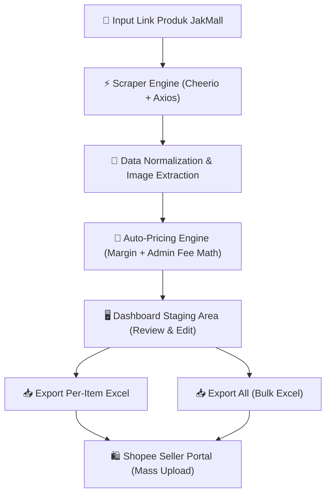

# 📑 SCRIPT & PANDUAN PRESENTASI PROJECT
> **Nama Project**: JakMall Product Scraper & Shopee Listing Automation  
> **Tujuan**: Otomatisasi Pemindahan & Mass Upload Data Produk dari JakMall ke Shopee Seller Portal  
> **Karakteristik Utama**: *Zero Operational Cost ($0)*, Presisi Auto-Pricing, & Standard Compliance Shopee Mass Upload  

---

## 🎙️ 1. PEMBUKAAN (OPENING STATEMENT)

> **Gaya Bicara**: Ramah, profesional, percaya diri, dan berfokus pada efisiensi bisnis.

```text
"Selamat pagi/siang Bapak/Ibu. Terima kasih atas waktunya.

Hari ini saya ingin mempresentasikan hasil pengembangan Proof of Concept (PoC) Automation Tool: 
JakMall to Shopee Listing Automation.

Tujuan utama dari sistem ini adalah mengeliminasi proses input manual pemindahan data produk 
dari katalog supplier JakMall ke toko Shopee Seller secara otomatis, cepat, dan presisi — 
tanpa mengeluarkan biaya operasional API berbayar sama sekali."
```

---

## 💡 2. LATAR BELAKANG & MASALAH YANG DISELESAIKAN (POIN 1 PDF)

### 📌 Penjelasan Non-Teknis (Value Bisnis)
> *"Saat ini, proses upload produk dropship/reseller dari JakMall ke Shopee jika dilakukan secara manual sangat memakan waktu. Tim harus menyalin judul, deskripsi, mengunduh foto galeri satu per satu, menghitung harga jual secara manual agar tidak rugi terpotong biaya admin Shopee, lalu menginputnya ke Shopee.*
> 
> *Jika ada 50–100 produk per hari, alur manual ini sangat lambat, melelahkan, dan rentan terhadap human error terutama pada perhitungan margin & biaya admin."*

### ⚙️ Asumsi & Batasan Kunci
1. **Scraping Publik**: Data diambil dari katalog publik JakMall tanpa perlu API resmi JakMall.
2. **Standard Shopee Mass Upload**: Menggunakan format Excel Resmi Shopee (`basic_template.xlsx`) karena merupakan metode paling aman (bebas captcha/blokir akun) dan 100% gratis.
3. **Stok Stabil**: Informasi stok diset pada nilai konstan yang aman (misal: 100 pcs) untuk stabilitas toko.

---

## 🏗️ 3. ARSITEKTUR & TECH STACK (POIN 2 PDF)

### 🔷 Penjelasan Non-Teknis
> *"Aplikasi ini dibangun menggunakan arsitektur web modern yang dapat diakses langsung dari browser tanpa perlu menginstal aplikasi tambahan di komputer user."*

### ⚙️ Penjelasan Teknis
| Komponen | Teknologi | Alasan & Keunggulan Teknis |
| :--- | :--- | :--- |
| **Framework Fullstack** | Next.js 16 (React, TypeScript, Tailwind CSS) | Performa tinggi, *type-safe*, dan memisahkan logika UI & backend dengan rapi. |
| **Scraper Engine** | Node.js `Cheerio` & `Axios` | Melakukan HTTP HTML parsing secara langsung di server tanpa overhead browser (jauh lebih cepat & efisien dibanding selenium/playwright). |
| **Excel Generator** | `ExcelJS` | Membaca & menyusun file Excel yang 100% kompatibel dengan template resmi Mass Upload Shopee. |
| **Pricing Engine** | Custom Math Calculator | Formula presisi untuk menghitung modal, margin keuntungan, dan estimasi biaya potongan admin/packing Shopee. |

### 🔄 Diagram Alur Sistem (Architecture Flow)



---

## 💻 4. DEMO LANGSUNG & ALUR PENGGUNAAN / USER FLOW (POIN 3 PDF)

> **[Petunjuk Pembawa Acara]**: Tunjukkan layar aplikasi di browser saat menjelaskan langkah-langkah ini.

### 🔹 Langkah 1: Input & Ekstraksi Produk
> *"User cukup memasukkan URL halaman produk JakMall ke kolom input, lalu menekan tombol **Ekstrak**.*  
> *Sistem dalam beberapa detik mengambil judul, deskripsi lengkap, foto-foto galeri, opsi variasi (warna/ukuran), SKU, berat, dan harga modal."*

### 🔹 Langkah 2: Formula Auto-Pricing Otomatis
> *"Sistem langsung menerapkan rumus penyesuaian harga jual:*
> $$\text{Harga Jual Shopee} = \frac{\text{Harga Modal} + \text{Margin Keuntungan Target}}{\text{100\%} - \text{Estimasi Biaya Admin \%}}$$
> *Sehingga profit bersih yang diterima toko dijamin sesuai dengan ekspektasi margin bisnis."*

### 🔹 Langkah 3: Review di Staging Area
> *"Seluruh produk hasil ekstraksi dikumpulkan di **Staging Area**. User bisa melihat preview estimasi keuntungan, jumlah varian, stok, serta status kesiapan upload."*

### 🔹 Langkah 4: Export Excel Shopee (Single & Bulk Export)
> *"User dapat memilih meng-export **satu per satu (per item)** atau memilih **Export All** untuk mengunduh seluruh produk sekaligus dalam format Excel Mass Upload Shopee yang valid."*

---

## 🛠️ 5. BAGIAN TERSULIT & PENYELESAIANNYA / PROBLEM SOLVING (POIN 4 PDF)

### 1️⃣ Presisi Perhitungan Harga & Potongan Admin Shopee
* **Tantangan**: Terjadi pembulatan desimal yang menyebabkan selisih beberapa rupiah antara perhitungan modal, biaya admin Shopee, dan profit bersih.
* **Penyelesaian**: Mengimplementasikan pembulatan terstandarisasi (`Math.round`) dengan penyesuaian tarif persen biaya admin/packing, sehingga harga jual di Shopee menghasilkan keuntungan yang persis sesuai estimasi.

### 2️⃣ Kepatuhan Strict Validasi Template Mass Upload Shopee (Kolom 18 `Kode Variasi`)
* **Tantangan**: Upload file per-item sempat ditolak oleh Shopee dengan laporan error di file hasil (*Failed Upload*).
* **Penyebab Teknis**: Berdasarkan spesifikasi ketat Shopee:
  * **Produk Varian**: Kolom 18 (`Kode Variasi`) **WAJIB DIISI**.
  * **Produk Tanpa Varian (Single Item)**: Kolom 18 (`Kode Variasi`) **WAJIB KOSONG**.
* **Penyelesaian**: Mengubah logika pada file `src/lib/shopee/excel-exporter.ts` sehingga produk non-variasi secara otomatis mengosongkan Kolom 18. Hasilnya, file per-item maupun bulk export 100% lolos validasi Shopee tanpa error.

---

## 💰 6. PERKIRAAN BIAYA OPERASIONAL / COST EFFICIENCY (POIN 5 PDF)

| Komponen | Solusi Lain (Umum) | Solusi Project Ini | Biaya |
| :--- | :--- | :--- | :--- |
| **API Scraping** | Third-party paid API / SaaS | Custom Cheerio/Axios Scraper | **Rp 0** |
| **Shopee Integration** | Paid Integration Services | Official Shopee Mass Upload Excel | **Rp 0** |
| **Hosting & Infrastructure** | Dedicated Cloud Server | Local / Free Tier (Vercel/Render) | **Rp 0** |
| **Total Operasional** | Rp 500rb - Rp 2jt / bulan | **Zero Cost Solution** | **Rp 0 / Bulan** |

---

## 🚀 7. LIMITASI SAAT INI & ROADMAP MASA DEPAN (POIN 6 PDF)

1. **Direct Shopee Open API Integration**:
   * *Saat Ini*: Menggunakan Mass Upload Excel (Sangat aman & gratis).
   * *Masa Depan*: Jika perusahaan memiliki lisensi Shopee Open API Partner, aplikasi dapat di-upgrade ke 1-Click Direct API Upload.
2. **Auto Price & Stock Sync**:
   * *Masa Depan*: Menambahkan background cron job untuk otomatis memperbarui harga/stok jika supplier JakMall mengubah harganya.
3. **AI Smart Category & Attribute Mapping**:
   * *Masa Depan*: Integrasi LLM ringan untuk memetakan kategori produk JakMall ke kategori Shopee secara otomatis 100% akurat.

---

## 🎯 8. PENUTUP (CLOSING STATEMENT)

```text
"Kesimpulannya, PoC ini telah berhasil memenuhi seluruh requirement bisnis maupun teknis 
yang disyaratkan: mulai dari ekstraksi data produk, auto-pricing presisi, staging area preview, 
hingga pembuat file Mass Upload Shopee yang 100% lolos validasi.

Solusi ini siap digunakan untuk meningkatkan efisiensi operasional toko secara signifikan 
tanpa menambah biaya operasional perangkat lunak.

Terima kasih atas perhatian Bapak/Ibu, saya persilakan jika ada pertanyaan atau saran."
```

---

### 💡 TIPS TAMBAHAN UNTUK DEMO LIVE:
1. Jalankan aplikasi di browser sebelum sesi presentasi dimulai (`npm run dev` / `http://localhost:3000`).
2. Siapkan 1 URL Produk JakMall single item dan 1 URL produk varian untuk dites langsung.
3. Siapkan tab **Shopee Seller Center** (bagian *Mass Upload*) untuk membuktikan bahwa file Excel yang di-export bisa di-upload dengan status **Sukses**.
